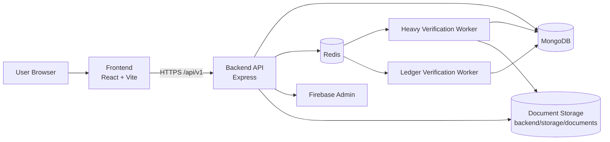
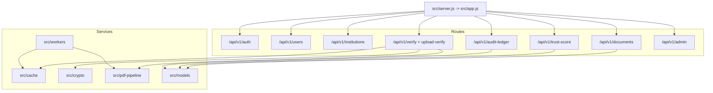
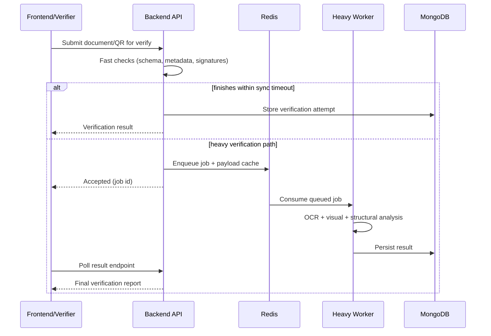

# SatyaPramaan

Full-stack digital document issuance and verification platform with tamper checks, trust scoring, audit chain verification, and Firebase-authenticated access.

## Table of Contents

- [Overview](#overview)
- [Core Capabilities](#core-capabilities)
- [Architecture](#architecture)
- [Repository Structure](#repository-structure)
- [Tech Stack](#tech-stack)
- [Getting Started](#getting-started)
- [API Domains](#api-domains)
- [Environment Variables](#environment-variables)
- [Runbook](#runbook)
- [Testing](#testing)
- [Security Notes Before GitHub Push](#security-notes-before-github-push)
- [Roadmap Ideas](#roadmap-ideas)

## Overview

SatyaPramaan is organized as a monorepo with:

- `digisecure-backend`: Node.js/Express API + MongoDB + Redis workers
- `digisecure-frontend`: React + Vite client app
- root PowerShell scripts for local process orchestration

The platform supports a full document trust lifecycle:

1. Institutions issue signed documents.
2. Documents can be verified from QR links or uploaded files.
3. A verification engine checks cryptographic, structural, and visual integrity.
4. Trust scoring and audit ledger endpoints provide governance visibility.

## Core Capabilities

- Firebase-backed authentication and role-aware APIs
- Document issuance, versioning, replacement, and revocation flows
- PDF verification with OCR and visual-diff guardrails
- Async verification workers for heavy verification tasks
- Audit chain and trust score APIs
- Redis-backed caching and queue-related state

## Architecture

### 1) System Context



### 2) Backend Request and Module Topology



### 3) Verification Pipeline (Conceptual)



## Repository Structure

```text
.
|-- start-digisecure.ps1
|-- stop-digisecure.ps1
|-- digisecure-backend/
|   |-- docker-compose.yml
|   |-- Dockerfile
|   |-- src/
|   |   |-- app.js
|   |   |-- server.js
|   |   |-- cache/
|   |   |-- config/
|   |   |-- crypto/
|   |   |-- middleware/
|   |   |-- models/
|   |   |-- modules/
|   |   |   |-- admin/
|   |   |   |-- audit-ledger/
|   |   |   |-- auth/
|   |   |   |-- documents/
|   |   |   |-- institutions/
|   |   |   |-- issuance/
|   |   |   |-- trust-score/
|   |   |   |-- users/
|   |   |   |-- verification/
|   |   |-- pdf-pipeline/
|   |   |-- scripts/
|   |   |-- utils/
|   |   |-- workers/
|   |-- storage/documents/
|   `-- tests/
|       |-- integration/
|       `-- unit/
`-- digisecure-frontend/
    |-- src/
    |   |-- App.jsx
    |   |-- contexts/
    |   |-- lib/
    |   `-- assets/
    |-- public/
    `-- vite.config.js
```

## Tech Stack

### Frontend

- React 19
- Vite 8
- React Router
- Firebase Web SDK
- PDF.js + QR code utilities

### Backend

- Node.js + Express
- MongoDB (Mongoose)
- Redis (ioredis)
- Firebase Admin SDK
- Tesseract OCR + PDF processing libraries
- Jest + Supertest

## Getting Started

### 1) Prerequisites

- Node.js 20+
- npm
- MongoDB (local or cloud)
- Redis

### 2) Install Dependencies

```powershell
cd digisecure-backend
npm.cmd install

cd ../digisecure-frontend
npm.cmd install
```

### 3) Configure Environment

Copy and edit environment files:

```powershell
Copy-Item digisecure-backend/.env.example digisecure-backend/.env
Copy-Item digisecure-frontend/.env.example digisecure-frontend/.env
```

### 4) Run Locally

### Option A: Use root helper scripts

```powershell
./start-digisecure.ps1
```

Stop both processes:

```powershell
./stop-digisecure.ps1
```

### Option B: Run manually

Backend:

```powershell
cd digisecure-backend
npm.cmd run dev
```

Frontend:

```powershell
cd digisecure-frontend
npm.cmd run dev
```

Default URLs:

- Frontend: http://localhost:5173
- Backend health: http://localhost:4000/health

## API Domains

- `/api/v1/auth`: authentication bootstrap, identity context
- `/api/v1/users`: user profile and role-aware user operations
- `/api/v1/institutions`: institution profile and settings
- `/api/v1/documents`: issuance, listing, retrieval, replace/revoke/versioning
- `/api/v1/verify` and related verification routes: QR and file verification flows
- `/api/v1/trust-score`: trust score and historical trust data
- `/api/v1/audit-ledger`: audit history and chain verification
- `/api/v1/admin`: administrative operations

## Environment Variables

### Backend required minimum

- `MONGODB_URI`
- `REDIS_URL`
- `APP_BASE_URL`
- `CORS_ORIGIN`

### Backend common optional

- Firebase: `FIREBASE_SERVICE_ACCOUNT_JSON` or `FIREBASE_PROJECT_ID` + `FIREBASE_CLIENT_EMAIL` + `FIREBASE_PRIVATE_KEY`
- OCR and verification tuning: `OCR_*`, `VISUAL_DIFF_*`, `SYNC_VERIFICATION_TIMEOUT_MS`
- Crypto and blockchain settings: `PRIVATE_KEY_MASTER_KEY_*`, `BLOCKCHAIN_*`

### Frontend required

- `VITE_API_BASE_URL`
- `VITE_API_ORIGIN`
- `VITE_FIREBASE_API_KEY`
- `VITE_FIREBASE_AUTH_DOMAIN`
- `VITE_FIREBASE_PROJECT_ID`
- `VITE_FIREBASE_STORAGE_BUCKET`
- `VITE_FIREBASE_MESSAGING_SENDER_ID`
- `VITE_FIREBASE_APP_ID`

## Runbook

### Backend scripts

```powershell
cd digisecure-backend
npm.cmd run dev
npm.cmd run start
npm.cmd run worker:verification
npm.cmd run worker:ledger
npm.cmd run check:readiness
npm.cmd run migrate:idempotency-index
```

### Frontend scripts

```powershell
cd digisecure-frontend
npm.cmd run dev
npm.cmd run build
npm.cmd run preview
npm.cmd run lint
```

### Docker (backend stack)

```powershell
cd digisecure-backend
docker compose up --build
```

This brings up API + MongoDB + Redis using `digisecure-backend/docker-compose.yml`.

## Testing

```powershell
cd digisecure-backend
npm.cmd test
```

Test suites include integration and unit coverage under `digisecure-backend/tests`.

## Security Notes Before GitHub Push

- Do not commit real credentials in `.env`, `.env.example`, or logs.
- Rotate any Firebase, DB, or private-key material if it was ever committed.
- Keep `storage/documents` out of public commits unless files are anonymized fixtures.
- Add branch protection and required checks for production repositories.

## Roadmap Ideas

- Add GitHub Actions for lint, tests, and Docker build validation
- Publish OpenAPI docs for all `/api/v1` routes
- Add architecture decision records (ADRs) for crypto, OCR, and worker design
- Add end-to-end tests across frontend + backend in CI
